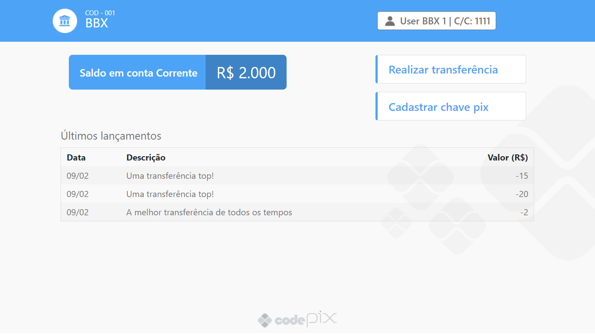

# 💳 Codepix - Um simulador de Transações Pix

Codepix é um programa desenvolvido na "Imersão Full Stack && Full Cycle" da [Full Cycle](https://www.youtube.com/fullcycle)

  

  
  
  
  
  
  
  

## 📂 Repositório Oficial

O conteúdo oficial está no repositório abaixo:
- [codeedu/imersao-fullstack-fullcycle](https://github.com/codeedu/imersao-fullstack-fullcycle)

## Tecnologias Utilizadas

* [Docker](https://www.docker.com/)
* [Node](https://nodejs.org/en/)
* [Go](https://golang.org/)
* [gRPC](https://grpc.io/)
* [Next.js](https://nextjs.org/)
* [NestJS](https://nestjs.com/)
* [PostgreSQL](https://www.postgresql.org/)
* [Apache Kafka](https://kafka.apache.org/)

## 📃 License

See the [LICENSE](LICENSE) file for details.
